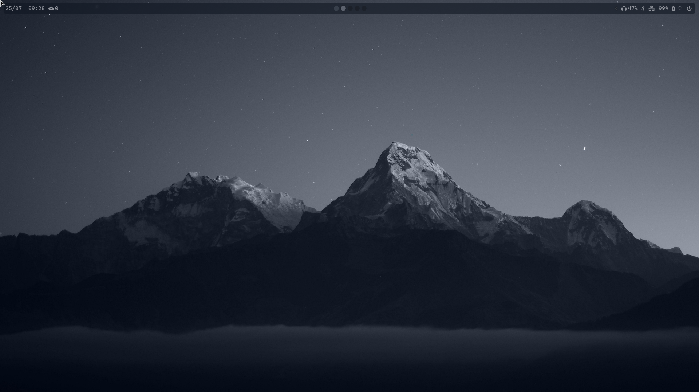

# ticogafa/dotfiles

Opinionated, reproducible development environment for macOS and Linux: shell, editor, terminal, tooling, and sensible defaults.

<!--
Note: Image paths below are placeholders. Replace them with the correct relative paths for your existing images in this repo.
-->

## Screenshots

- Desktop
  

- Terminal
  

- Neovim
  

- Tmux
  

- Git / Diffs
  


## What’s inside

- Shell: zsh with aliases, functions, and prompt
- Editor: Neovim configuration (LSP, Treesitter, formatting, linting)
- Terminal multiplexer: tmux config and plugins
- Git: global config, ignore rules, helpful aliases
- Package management: Homebrew bundle (macOS), common CLI tools
- macOS defaults: opinionated system preferences (if applicable)
- Fonts and terminal: configuration for popular terminals and dev fonts
- Scripts: bootstrap and update helpers
- Language toolchains: optional setup hooks (e.g., Node, Python, Go, etc.)

Note: The exact modules and tools depend on the repository contents. Adjust the “What’s inside” list to match the directories you enable with symlinks or your dotfile manager.


## Quick start

Clone this repository:

```bash
# SSH
git clone git@github.com:ticogafa/dotfiles.git ~/.dotfiles
# or HTTPS
git clone https://github.com/ticogafa/dotfiles ~/.dotfiles
cd ~/.dotfiles
```

Choose one of the approaches below to manage symlinks and apply the configuration.


### Option A: GNU Stow (recommended)

```bash
# macOS (Homebrew)
brew install stow
# Debian/Ubuntu
sudo apt-get update && sudo apt-get install -y stow

# From the repo root, stow the modules you want:
stow zsh
stow git
stow nvim
stow tmux
# stow <module> ...
```

This will create symlinks from the repository to your home directory. For example, `stow zsh` links files from `zsh/` to `~`.


### Option B: Chezmoi

If you prefer Chezmoi for managing dotfiles:

```bash
# macOS
brew install chezmoi
# Debian/Ubuntu
sudo apt-get install -y chezmoi

chezmoi init --apply ticogafa
```

Chezmoi will clone and apply your configuration to your home directory.


### Option C: Manual bootstrap script

If this repo includes a bootstrap script:

```bash
chmod +x script/bootstrap
./script/bootstrap
```

This typically installs prerequisites and creates symlinks. Inspect the script before running to understand what it does.


## Prerequisites

- macOS or a modern Linux distribution
- Git
- One of:
  - GNU Stow (if using Option A)
  - Chezmoi (if using Option B)
- Optional:
  - Homebrew (macOS): https://brew.sh
  - Common CLI tools (e.g., fzf, ripgrep, bat)
  - A Nerd Font (e.g., JetBrains Mono Nerd Font)


## Updating

Pull the latest changes and re-apply:

```bash
cd ~/.dotfiles
git pull
# If using Stow, re-stow modules you’ve changed:
stow -R zsh git nvim tmux
# If using Chezmoi:
chezmoi apply
```


## macOS defaults (optional)

If this repo contains a `macos` or `defaults` script, run it to apply system preferences:

```bash
chmod +x script/macos
./script/macos
```

Log out and back in (or restart) for some settings to take effect.


## Structure (example)

```
~/.dotfiles
├─ zsh/           # .zshrc, zsh functions, completions
├─ nvim/          # Neovim config (init.lua/lua/)
├─ tmux/          # .tmux.conf and plugins
├─ git/           # .gitconfig, .gitignore_global
├─ brew/          # Brewfile for macOS packages
├─ script/        # bootstrap, macos, update helpers
└─ images/        # screenshots used in this README
```

Adjust this map to match the actual directories in your repository.


## Troubleshooting

- Stow created files in the wrong place
  - Ensure you run `stow` from the repo root (where module directories live).
  - Use `stow -n <module>` to do a dry run first.
- Conflicting existing files
  - Back up or remove conflicting dotfiles before stowing.
- Neovim LSP/formatters not working
  - Make sure language servers and formatters are installed (Mason or system package managers).
- Fonts/icons look wrong in terminal
  - Install a Nerd Font and set your terminal to use it.


## Contributing

PRs and suggestions welcome. If you borrow ideas, credit is appreciated.


## License

Unless noted otherwise in the repository, consider this configuration MIT-licensed. If a LICENSE file exists here, it governs.
