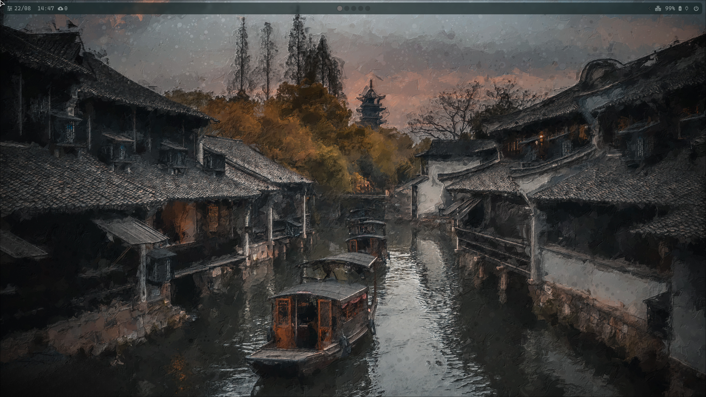

# 🐧 Dotfiles - Arch Linux + DankMaterialShell

> **Configuração completa e profissional para Arch Linux** com foco em produtividade, personalização extrema e design moderno usando **DankMaterialShell**, **Hyprland** e temas dinâmicos baseados em Material Design 3.



[](https://github.com/ticogafa/dotfiles/actions/workflows/shellcheck.yml)
[](https://github.com/ticogafa/dotfiles/actions/workflows/validate-pkglist.yml)
[](https://github.com/ticogafa/dotfiles/releases)
[](LICENSE)

---

## 📋 Índice

- [Visão Geral](#-visão-geral)
- [Principais Ferramentas](#-principais-ferramentas)
- [DankMaterialShell](#-dankmaterialshell)
- [Sistema de Temas](#-sistema-de-temas-matugen)
- [Recursos](#-recursos)
- [Instalação](#-instalação)
- [Estrutura do Repositório](#-estrutura-do-repositório)
- [Atalhos de Teclado](#️-atalhos-de-teclado)
- [Personalização](#-personalização)
- [GitHub Actions](#-github-actions--cicd)
- [Screenshots](#-screenshots)
- [Contribuições](#-contribuições)
- [Créditos](#-créditos)

---

## 🎯 Visão Geral

Este repositório contém minha configuração pessoal para Arch Linux, combinando o melhor de dois mundos: 

- **[DankMaterialShell](https://github.com/AvengeMedia/DankMaterialShell)** - Desktop Environment moderno baseado em GNOME Shell com Material Design 3
- **[Hyprland](https://hyprland.org/)** - Compositor Wayland minimalista e performático para sessões alternativas

O sistema é totalmente automatizado com:
- ✅ **Instalação em um comando**
- 🎨 **Temas dinâmicos sincronizados** entre todos os aplicativos
- 📦 **256 pacotes gerenciados** (210 oficiais + 46 AUR)
- 🤖 **6 workflows CI/CD** automatizados
- 🔄 **Versionamento semântico** (v1.0.0)

---

## ✨ Principais Ferramentas

### 🎨 Desktop Environments & Window Managers

#### DankMaterialShell (Principal)
- **Desktop Shell**: [DankMaterialShell](https://github.com/AvengeMedia/DankMaterialShell) - GNOME Shell com Material Design 3
- **Tema Engine**:  Matugen - Gerador de temas baseado em Material You
- **Esquema de Cores**: Dank16 (16 cores base + paleta Material Design 3)
- **Panel**:  DGOP (Desktop Graphical Overlay Panel)
- **Greeter**: DMS Greeter para Greetd

#### Hyprland (Alternativo)
- **Window Manager**: [Hyprland](https://hyprland.org/) - Compositor Wayland com animações
- **Barra de Status**: [Waybar](https://github.com/Alexays/Waybar)
- **Launcher**: [Wofi](https://hg.sr.ht/~scoopta/wofi) e [Rofi](https://github.com/davatorium/rofi)
- **Notificações**: [SwayNC](https://github.com/ErikReider/SwayNotificationCenter)
- **Lock Screen**:  Hyprlock
- **Idle Manager**:  Hypridle (gerenciado por power-manager. sh)
- **Logout Menu**: [Wlogout](https://github.com/ArtsyMacaw/wlogout)
- **Wallpaper**:  SWWW + Waypaper

### 💻 Desenvolvimento

- **Terminal**: [Kitty](https://sw.kovidgoyal.net/kitty/) - GPU-accelerated com temas dinâmicos
- **Shell**: [Fish](https://fishshell.com/) + [Starship](https://starship.rs/) prompt customizado
- **Editor**: [Neovim](https://neovim.io/) com [LazyVim](http://www.lazyvim.org/) e temas Matugen
- **Browser**: 
  - Firefox com Material Design CSS (via Matugen)
  - [Zen Browser](https://zen-browser.app/) tematizado
  - Pywalfox para sincronização de cores
- **IDE**: IntelliJ IDEA Community Edition
- **Container**: Docker + Docker Compose
- **Version Control**: Git, GitHub CLI, Lazygit

### 🛠️ Utilitários

- **Gerenciadores de Arquivo**: 
  - [Nemo](https://github.com/linuxmint/nemo) (GUI)
  - [Thunar](https://docs.xfce.org/xfce/thunar/start) (GUI leve)
  - Ranger (TUI)
- **Monitoramento**: 
  - [btop](https://github.com/aristocratos/btop) - Monitor de sistema
  - [fastfetch](https://github.com/fastfetch-cli/fastfetch) - System info
- **Clipboard**: cliphist + wl-clipboard
- **Visualizador de Áudio**: Cava (com cores dinâmicas)
- **Player de Música**: cmus + Spicetify (Spotify tematizado)
- **Screenshot**:  Hyprshot + Grim
- **Segurança**: BlackArch tools integrados
- **Notes**: Obsidian configurado
- **Bluetooth**: Bluetui + Blueman
- **Gaming**:  Gamescope, Steam (Proton)

### 🔧 Aplicações Adicionais

- **Produtividade**: LibreOffice Still (PT-BR)
- **KeePass**: KeePassXC para senhas
- **Comunicação**: Discord (via Veskto/Vesktop com temas)
- **KDE Connect**: Integração com dispositivos móveis
- **Launcher de AppImage**: AppImageLauncher

---

## 🌈 DankMaterialShell

**DankMaterialShell (DMS)** é o coração deste setup - um desktop environment completo que traz Material Design 3 para o Linux. 

### O que é DMS? 

Uma extensão completa do GNOME Shell que substitui a interface padrão por: 
- 🎨 **Design Material You**: Paleta de cores dinâmica baseada no wallpaper
- 🔄 **Sincronização Universal**: Temas aplicados em GTK, Qt, terminais, navegadores, e IDE
- ⚡ **Performance**:  Otimizado para uso diário
- 🎛️ **Controle Total**: Central de controle estilo Android

### Arquivos de Configuração

```
. config/DankMaterialShell/
├── settings.json           # Configurações principais do DMS
├── clsettings.json         # Configurações do clipboard
├── plugin_settings.json    # Plugins (KDE Connect, etc)
├── firefox. css            # Tema Material para Firefox
└── zen. css                # Tema Material para Zen Browser
```

### Principais Configurações DMS

- **Esquema de Cores**: `scheme-tonal-spot` (Material Design 3)
- **Transparência**: 70% em popups e dock
- **Border Radius**: 16px
- **Animações**: Velocidade 2x (500ms customizado)
- **Widgets Ativos**: 
  - Volume/Brilho sliders
  - WiFi e Bluetooth
  - Audio Output/Input
  - CPU/RAM/GPU monitoring
  - Temperatura do sistema
  - Gerenciador de Clipboard

---

## 🎨 Sistema de Temas (Matugen)

### Como Funciona

[Matugen](https://github.com/InioX/matugen) gera automaticamente esquemas de cores **Material Design 3** a partir do seu wallpaper, aplicando em: 

#### Aplicativos Suportados

1. **Terminal & Shell**
   - Kitty (cores e background)
   - Fish shell
   - Foot terminal

2. **Navegadores**
   - Firefox (`firefox.css` via userChrome)
   - Zen Browser (`zen.css` via userChrome)
   - Pywalfox (extensão)

3. **Editores & IDEs**
   - Neovim (via plugin dankcolors. lua)
   - VSCode (extensão DMS Theme)

4. **GTK & Qt**
   - GTK3/GTK4 (`gtk-colors.css`)
   - Qt6 (`qt6ct/colors/matugen.conf`)
   - KDE Color Scheme (`kcolorscheme.colors`)

5. **Window Managers**
   - Hyprland (via Waybar)
   - Niri compositor
   - DGOP panel

6. **Outros**
   - Discord/Vesktop (`veskto-wip.css`)
   - Cava (visualizador de áudio)
   - Spicetify (Spotify)

### Templates Matugen

Localizados em `.config/matugen/`:

```
matugen/
├── templates/              # Templates de temas
│   ├── neovim. lua
│   ├── gtk-colors.css
│   ├── firefox-userchrome.css
│   ├── zen-userchrome.css
│   ├── veskto-wip.css
│   ├── foot. ini
│   ├── kitty.conf
│   └── ... 
├── configs/                # Configurações de output
│   ├── firefox.toml
│   ├── zenbrowser.toml
│   ├── dgop.toml
│   ├── niri.toml
│   └── ...
└── vsix-build/            # VSCode extension
    ├── themes/
    └── package.json
```

### Paleta Dank16

Esquema de 16 cores base inspirado em Base16 + Material Design: 

- `color0-7`: Tons escuros → claros (backgrounds, textos)
- `color8-15`: Cores de destaque (azul, verde, amarelo, vermelho, etc)

Cada cor possui variantes:  `default`, `light`, `dark`

---

## 🚀 Recursos

- ✅ **Instalação 100% Automatizada**: Script `install.sh` completo
- 🎨 **Temas Dinâmicos Universais**: Um wallpaper, temas em todos apps
- 🔄 **Sincronização em Tempo Real**: Mudanças aplicadas instantaneamente
- ⚡ **Multi-GPU**: Suporte AMD/Intel/NVIDIA com otimizações
- 🔧 **Modular**: Fácil adicionar/remover componentes
- 📦 **Gerenciamento Automático de Pacotes**: 
  - `pkglist.txt` (210 pacotes oficiais)
  - `aur_pkglist.txt` (46 pacotes AUR)
- 🐳 **Container Ready**: Docker configurado
- 🎮 **Gaming**:  Gamescope, Proton, Steam otimizado
- 🔒 **Segurança**: Tools BlackArch + validação ShellCheck
- 🤖 **CI/CD**: 6 workflows GitHub Actions
- 📊 **Estatísticas Auto-geradas**: `STATS.md` atualizado automaticamente
- 📝 **Versionamento Semântico**:  Releases organizadas ([v1.0.0](https://github.com/ticogafa/dotfiles/releases))

---

## 📦 Instalação

### Pré-requisitos

- Arch Linux instalado e atualizado
- Conexão com internet
- Usuário com privilégios `sudo`

### Método 1: Instalação Completa (Recomendado)

Instala **DankMaterialShell + Hyprland** com todas as configurações:

```bash
# 1. Clone o repositório
git clone https://github.com/ticogafa/dotfiles.git ~/. dotfiles
cd ~/.dotfiles

# 2. Execute o instalador
chmod +x install.sh
./install.sh
```

O script irá:
1. ✅ Verificar dependências (pacman, yay)
2. ✅ Instalar 256 pacotes (pode demorar 20-40min)
3. ✅ Criar backups das configurações existentes em `~/backup-configs/`
4. ✅ Criar links simbólicos para `.config/`
5. ✅ Configurar serviços (Docker, greetd, etc)
6. ✅ Aplicar temas

### Método 2: Instalação Manual

Para quem prefere controle total:

#### Passo 1: Dependências Base

```bash
# Instalar pacotes oficiais
sudo pacman -S --needed - < pkglist.txt

# Instalar yay (AUR helper)
git clone https://aur.archlinux.org/yay.git
cd yay && makepkg -si && cd .. 

# Instalar pacotes do AUR
yay -S --needed - < aur_pkglist.txt
```

#### Passo 2: Configurações

```bash
# Backup das configurações atuais
mkdir -p ~/backup-configs
cp -r ~/. config/{hypr,fish,nvim,waybar,kitty,DankMaterialShell} ~/backup-configs/ 2>/dev/null

# Criar links simbólicos
ln -sf ~/.dotfiles/.config/* ~/.config/
ln -sf ~/.dotfiles/.bashrc ~/.bashrc
ln -sf ~/.dotfiles/.bash_profile ~/.bash_profile
ln -sf ~/.dotfiles/.inputrc ~/.inputrc
```

#### Passo 3: Serviços

```bash
# Docker
sudo systemctl enable --now docker
sudo usermod -aG docker $USER

# Greetd (display manager)
sudo systemctl enable greetd

# Bluetooth
sudo systemctl enable bluetooth
```

#### Passo 4: Aplicar Temas

```bash
# DMS aplicará temas automaticamente na primeira execução
# Para Hyprland/Waybar (pywal):
cd ~/.config/backgrounds
wal -i <sua-imagem. jpg>
```

### Pós-Instalação

```bash
# Logout e selecione "DankMaterialShell" no greeter
# Ou para Hyprland: 
# Selecione "Hyprland" no greeter

# Primeira inicialização: aguarde 30s para serviços iniciarem
```

---

## 📁 Estrutura do Repositório

```
dotfiles/
├── .config/                       # Todas as configurações
│   ├── DankMaterialShell/        # ⭐ Configurações principais do DMS
│   │   ├── settings.json         # Configurações gerais
│   │   ├── clsettings.json       # Clipboard manager
│   │   ├── plugin_settings.json  # Plugins (KDE Connect)
│   │   ├── firefox.css          # Tema Firefox
│   │   └── zen.css              # Tema Zen Browser
│   │
│   ├── matugen/                  # 🎨 Sistema de temas
│   │   ├── templates/           # Templates de cores
│   │   ├── configs/             # Configurações de output
│   │   └── vsix-build/          # VSCode extension
│   │
│   ├── hypr/                     # Hyprland configs
│   │   ├── hyprland.conf        # Config principal
│   │   ├── configurations/      # Configs modulares
│   │   │   ├── keybindings.conf
│   │   │   ├── monitors.conf
│   │   │   ���── startup.conf
│   │   └── scripts/             # Scripts de automação
│   │       ├── autostart.sh     # Inicialização
│   │       ├── power. sh         # Gerenciamento de energia
│   │       ├── power-manager.sh # Gerencia hypridle (AC/bateria)
│   │       ├── wallpaper.sh     # Seletor de wallpaper + pywal
│   │       ├── brightness.sh    # Controle de brilho
│   │       └── volume.sh        # Controle de volume
│   │
│   ├── fish/                     # Fish shell
│   │   ├── config.fish
│   │   └── functions/
│   │
│   ├── nvim/                     # Neovim (LazyVim)
│   │   ├── init.lua
│   │   └── lua/
│   │       └── plugins/
│   │           └── dankcolors.lua # Plugin de cores Matugen
│   │
│   ├── kitty/                    # Terminal Kitty
│   │   ├── kitty.conf
│   │   └── current-theme.conf    # Tema dinâmico
│   │
│   ├── waybar/                   # Barra Hyprland
│   │   ├── config
│   │   └── style.css
│   │
│   ├── wofi/                     # Launcher
│   ├── rofi/                     # Launcher alternativo
│   ├── swaync/                   # Centro de notificações
│   ├── wlogout/                  # Menu de logout
│   ├── cava/                     # Visualizador de áudio
│   ├── fastfetch/                # System info
│   ├── spicetify/                # Spotify themes
│   ├── obsidian/                 # Obsidian notes
│   ├── nemo/                     # File manager
│   ├── Thunar/                   # File manager alternativo
│   ├── dgop/                     # DGOP panel
│   ├── systemd/                  # User services
│   ├── nwg-look/                 # GTK theme selector
│   ├── backgrounds/              # Wallpapers
│   ├── starship. toml            # Starship prompt
│   └── background               # Wallpaper atual
│
├── .github/                      # 🤖 GitHub Actions
│   └── workflows/
│       ├── shellcheck.yml       # Validação de scripts
│       ├── validate-pkglist.yml # Valida listas de pacotes
│       ├── update-pkglist.yml   # Atualiza listas automaticamente
│       ├── symlink-test.yml     # Testa instalação
│       ├── generate-screenshots.yml # Gera estatísticas
│       ├── release.yml          # Releases automáticas
│       └── automated-tests.yml  # Suite de testes completa
│
├── screenshots/                  # 📸 Imagens do setup
│   ├── desktop.png
│   ├── fish.png
│   └── nvim-1.png
│
├── video/                        # 🎥 Vídeos de demonstração
│   └── 2025-08-22-14-55-43.mp4
│
├── .bash_profile                 # Bash profile
├── .bashrc                       # Bash config
├── .inputrc                      # Readline config
├── .shellcheckrc                 # ShellCheck rules
│
├── install.sh                    # 🚀 Script de instalação
├── pkglist.txt                   # 📦 210 pacotes oficiais
├── aur_pkglist.txt              # 📦 46 pacotes AUR
├── pacman. conf                   # Configuração do Pacman
│
├── CHANGELOG.md                  # 📝 Histórico de mudanças
├── RELEASING.md                  # 📋 Guia de versionamento
├── STATS. md                      # 📊 Estatísticas do repo
├── LICENSE                       # MIT License
└── README.md                     # Este arquivo
```

---

## ⌨️ Atalhos de Teclado

### DankMaterialShell

DMS usa os atalhos padrão do GNOME Shell com algumas adições:

| Atalho | Ação |
|--------|------|
| `SUPER` | Abrir Activities/Overview |
| `SUPER + T` | Abrir terminal |
| `SUPER + E` | Abrir gerenciador de arquivos |
| `SUPER + L` | Bloquear tela |
| `SUPER + D` | Mostrar desktop |
| `SUPER + M` | Central de controle DMS |
| `SUPER + V` | Histórico do clipboard |
| `ALT + F2` | Executar comando |
| `SUPER + TAB` | Alternar janelas |
| `SUPER + [1-9]` | Mudar para workspace |
| `SUPER + SHIFT + [1-9]` | Mover janela para workspace |

### Hyprland

Configuração completa em `.config/hypr/configurations/keybindings.conf`

#### Principais Atalhos

| Atalho | Ação |
|--------|------|
| `SUPER + Q` | Abrir terminal (Kitty) |
| `SUPER + C` | Fechar janela ativa |
| `SUPER + E` | Gerenciador de arquivos (Nemo) |
| `SUPER + SPACE` | Launcher (Wofi) |
| `SUPER + L` | Bloquear tela (hyprlock) |
| `SUPER + W` | Menu de energia (wlogout) |
| `SUPER + SHIFT + W` | Seletor de wallpaper |
| `SUPER + SHIFT + V` | Histórico do clipboard |
| `SUPER + I` | Buscar e abrir arquivo no Neovim (fzf) |
| `PRINT` | Screenshot da janela |
| `SHIFT + PRINT` | Screenshot de área |
| `SUPER + [1-9]` | Mudar para workspace 1-9 |
| `SUPER + SHIFT + [1-9]` | Mover janela para workspace |

#### Navegação de Janelas

| Atalho | Ação |
|--------|------|
| `SUPER + ←/→/↑/↓` | Mover foco entre janelas |
| `SUPER + SHIFT + ←/→/↑/↓` | Mover janela |
| `SUPER + F` | Alternar fullscreen |
| `SUPER + V` | Alternar modo floating |
| `SUPER + Mouse_Left` | Mover janela |
| `SUPER + Mouse_Right` | Redimensionar janela |

#### Multimídia

| Atalho | Ação |
|--------|------|
| `XF86AudioRaiseVolume` | Aumentar volume |
| `XF86AudioLowerVolume` | Diminuir volume |
| `XF86AudioMute` | Mutar/Desmutar |
| `XF86MonBrightnessUp` | Aumentar brilho |
| `XF86MonBrightnessDown` | Diminuir brilho |

---

## 🔧 Personalização

### Trocar Wallpaper e Aplicar Temas

#### No DankMaterialShell

1. Coloque wallpapers em `~/.config/backgrounds/`
2. Use o seletor de wallpaper do DMS (botão direito no desktop)
3. Matugen será executado automaticamente
4. Todos os apps serão tematizados instantaneamente

#### No Hyprland

```bash
# Via script (recomendado)
SUPER + SHIFT + W  # Abre seletor visual

# Via linha de comando
cd ~/.config/backgrounds
wal -i seu-wallpaper.jpg
```

O script `wallpaper.sh` automaticamente:
- Define wallpaper com SWWW
- Gera cores com Pywal
- Atualiza Kitty, Waybar, SwayNC
- Atualiza Cava
- Aplica no Firefox (via Pywalfox)

### Alterar Terminal

```bash
# Edite o arquivo de keybindings
nano ~/.config/hypr/configurations/keybindings.conf

# Linha: 
bind = $mainMod, Q, exec, kitty

# Troque por:  alacritty, foot, wezterm, etc
```

### Alterar Temas GTK/Qt

```bash
# GTK (interface gráfica)
nwg-look

# Qt6
qt6ct

# As cores Matugen serão aplicadas automaticamente
```

### Adicionar Novos Apps aos Temas Matugen

1. Crie um template em `.config/matugen/templates/`
   ```css
   /* exemplo:  meuapp.css */
   .minha-classe {
     background:  {{colors.background. default. hex}};
     color: {{colors.on_background.default.hex}};
   }
   ```

2. Configure o output em `.config/matugen/configs/`
   ```toml
   # meuapp.toml
   [templates. dmsmeuapp]
   input_path = 'SHELL_DIR/matugen/templates/meuapp.css'
   output_path = 'CONFIG_DIR/meuapp/colors.css'
   ```

3. Recarregue o tema
   ```bash
   # DMS faz automaticamente
   # Ou manualmente:
   matugen image ~/. config/background
   ```

### Scripts Personalizados

Adicione seus scripts em `.config/hypr/scripts/` e vincule em `keybindings.conf`:

```conf
bind = $mainMod SHIFT, X, exec, ~/. config/hypr/scripts/meu-script.sh
```

---

## 🐛 Solução de Problemas

### DankMaterialShell não inicia

```bash
# Verificar logs
journalctl -u greetd -e

# Recompilar
cd ~/.local/share/gnome-shell/extensions/dms@... 
meson build
ninja -C build
```

### Temas não aplicam automaticamente

```bash
# Regenerar manualmente
matugen image ~/.config/background

# Verificar se runUserMatugenTemplates está true
cat ~/.config/DankMaterialShell/settings.json | grep matugen
```

### Waybar não aparece (Hyprland)

```bash
killall waybar && waybar &
```

### Hyprland não inicia

```bash
# Verificar logs
cat ~/.config/hypr/hyprland.log

# Testar configuração
hyprctl reload
```

### Hypridle fica ativo na tomada

O script `power-manager.sh` gerencia isso automaticamente, mas você pode verificar:

```bash
# Ver se está rodando
pgrep -a power-manager

# Ver status AC
cat /sys/class/power_supply/ACAD/online
# 1 = AC plugged, 0 = battery
```

### Temas do Firefox/Zen não aplicam

```bash
# Verificar se os arquivos CSS existem
ls ~/. config/DankMaterialShell/*. css

# Para Firefox, certifique-se de habilitar userChrome.css:
# about:config → toolkit.legacyUserProfileCustomizations.stylesheets → true

# Pywalfox (extens��o)
pywalfox update
```

### Problemas com GPU NVIDIA

```bash
# Instalar drivers
sudo pacman -S nvidia-dkms nvidia-utils lib32-nvidia-utils

# Configurar Hyprland
# Adicione em ~/.config/hypr/hyprland.conf:
# env = LIBVA_DRIVER_NAME,nvidia
# env = XDG_SESSION_TYPE,wayland
# env = GBM_BACKEND,nvidia-drm
# env = __GLX_VENDOR_LIBRARY_NAME,nvidia
```

### Docker não funciona

```bash
# Adicionar usuário ao grupo
sudo usermod -aG docker $USER

# Reiniciar serviço
sudo systemctl restart docker

# Relogar ou: 
newgrp docker
```

---

## 🤖 GitHub Actions / CI/CD

Este repositório usa 6 workflows automatizados para manter qualidade e consistência:

### 1. ShellCheck (`shellcheck.yml`)
- **Quando**: Push e Pull Requests
- **O que faz**: Valida sintaxe de todos os scripts `.sh`, detecta erros e vulnerabilidades

### 2. Validate Package Lists (`validate-pkglist.yml`)
- **Quando**:  Mudanças em `pkglist.txt` ou `aur_pkglist.txt`
- **O que faz**: Verifica duplicatas, ordem alfabética, formatação

### 3. Auto-Update Package Lists (`update-pkglist.yml`)
- **Quando**: Semanalmente (segundas 9h UTC) ou manualmente
- **O que faz**: Ordena, remove duplicatas, cria PR automático

### 4. Test Symlink Creation (`symlink-test.yml`)
- **Quando**: Mudanças em `install.sh` ou `.config/`
- **O que faz**:  Simula instalação, valida estrutura de diretórios

### 5. Generate Statistics (`generate-screenshots.yml`)
- **Quando**: Push na main
- **O que faz**:  Atualiza `STATS.md` com contadores automáticos

### 6. Release (`release.yml`)
- **Quando**: Criação de tag `v*.*.*`
- **O que faz**: Gera release com arquivos, checksums e changelog

### Ver Status dos Workflows

Acesse: https://github.com/ticogafa/dotfiles/actions

### Executar Workflow Manualmente

1. Vá em **Actions** no GitHub
2. Selecione o workflow
3. Clique em **Run workflow**

---

## 📊 Estatísticas

Confira as estatísticas atualizadas automaticamente:  **[STATS.md](STATS.md)**

Última atualização: **Janeiro 2026**

- 📝 **Scripts Shell**: ~10
- 📦 **Pacotes Totais**: 256 (210 oficiais + 46 AUR)
- 📄 **Linhas de Código**: ~757 (scripts)
- 🔧 **Workflows CI/CD**: 6
- 🎨 **Templates Matugen**: 15+
- 🖥️ **Configurações de Apps**: 25+ diretórios

---

## 📸 Screenshots

### Desktop Principal (DankMaterialShell)


### Terminal Fish + Starship


### Neovim com LazyVim + Dank Colors


## 🎥 Vídeo de Demonstração

[▶️ Assista ao vídeo completo](video/2025-08-22-14-55-43.mp4)

> 💡 **Dica**:  Faça download do vídeo para melhor qualidade

---

## 🤝 Contribuições

Contribuições são muito bem-vindas! 

### Como Contribuir

1. **Fork** este repositório
2. Crie uma **branch** para sua feature:
   ```bash
   git checkout -b feature/minha-feature
   ```
3. **Commit** suas mudanças: 
   ```bash
   git commit -m "feat: adiciona suporte para X"
   ```
4. **Push** para o GitHub:
   ```bash
   git push origin feature/minha-feature
   ```
5. Abra um **Pull Request**

### Reportar Bugs

- 🐛 Use [Issues](https://github.com/ticogafa/dotfiles/issues)
- 💡 Sugira melhorias
- ⭐ Dê uma estrela se gostar!

### Diretrizes

- Siga o estilo de código existente
- Valide scripts com ShellCheck
- Atualize documentação relevante
- Teste antes de enviar PR

---

## 📝 Documentação Adicional

- **[CHANGELOG.md](CHANGELOG.md)** - Histórico completo de mudanças
- **[RELEASING.md](RELEASING.md)** - Guia de versionamento e releases
- **[STATS.md](STATS.md)** - Estatísticas do repositório
- **[. github/workflows/README.md](.github/workflows/README.md)** - Documentação dos workflows

---

## 🎯 Roadmap

Recursos planejados para próximas versões:

- [ ] Script de backup automatizado
- [ ] Suporte para múltiplos profiles de tema
- [ ] Integração com Rofi como launcher padrão
- [ ] Configuração para Sway (Wayland alternativo)
- [ ] Temas pré-configurados para instalação rápida
- [ ] Wiki com tutoriais detalhados
- [ ] Script de migração de outras distros

---

## 📄 Licença

Este projeto está licenciado sob a **MIT License** - veja [LICENSE](LICENSE) para detalhes.

---

## 🙏 Créditos

### Projetos Principais

- **[DankMaterialShell](https://github.com/AvengeMedia/DankMaterialShell)** - Desktop Environment base
- **[Hyprland](https://hyprland.org/)** - Compositor Wayland
- **[Matugen](https://github.com/InioX/matugen)** - Material Design theme generator
- **[LazyVim](http://www.lazyvim.org/)** - Configuração Neovim
- **[Pywal](https://github.com/dylanaraps/pywal)** - Gerador de esquemas de cores
- **[Starship](https://starship.rs/)** - Shell prompt

### Comunidades

- [Arch Linux](https://archlinux.org/)
- [r/unixporn](https://reddit.com/r/unixporn)
- [Hyprland Discord](https://discord.gg/hyprland)

### Inspirações

Configurações que inspiraram este setup:
- [end-4/dots-hyprland](https://github.com/end-4/dots-hyprland)
- [prasanthrangan/hyprdots](https://github.com/prasanthrangan/hyprdots)
- [JaKooLit/Hyprland-Dots](https://github.com/JaKooLit/Hyprland-Dots)

---

## 📞 Contato

- **GitHub**: [@ticogafa](https://github.com/ticogafa)
- **Issues**: [ticogafa/dotfiles/issues](https://github.com/ticogafa/dotfiles/issues)

---

<div align="center">

### ⭐ Se este projeto foi útil, considere dar uma estrela!

**Última atualização**:  Janeiro 2026 | **Versão**: v1.0.0


</div>
