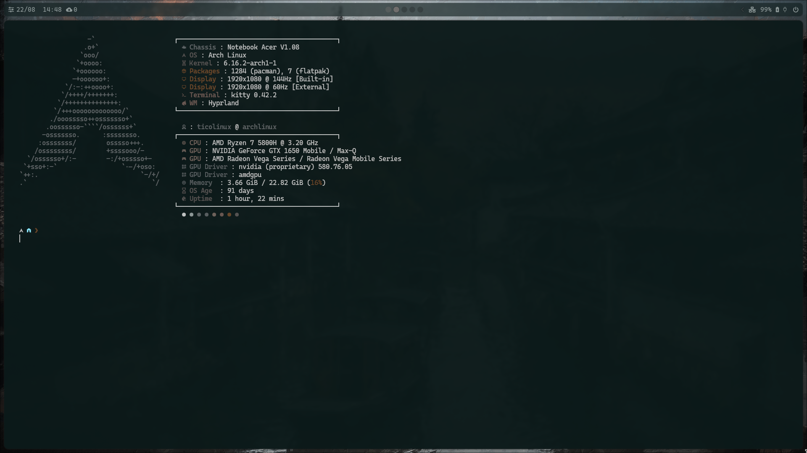
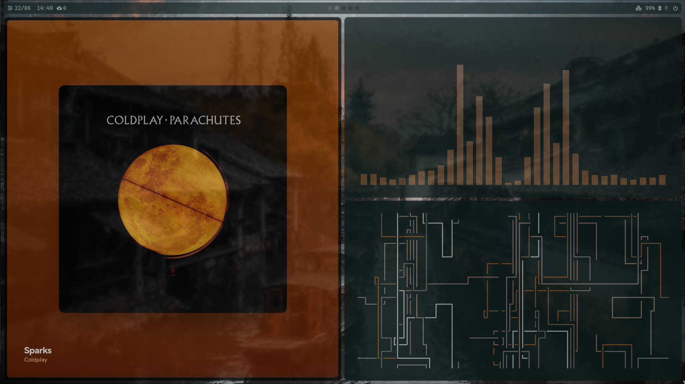
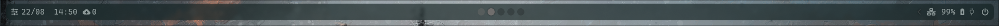

# dotfiles

Personal dotfiles for Linux, focused on a streamlined, productive, and highly customizable environment. These configs are designed for easy adaptation and forking—feel free to use as a base for your own workspace!

## Key Features

- **Modular and easy to extend**
- **User-centric**: Minimal, but powerful defaults
- **No bootstrap scripts**: Manual installation for transparency and control

## Main Tools & Configurations


### Fish Shell

A modern command-line shell, configured for productivity and aesthetics. Includes custom prompts, aliases, and completions.




### Waybar

Minimal and highly customizable status bar for Wayland compositors, replacing Hyprpanel in this setup. Themed for clarity and seamless desktop integration.

<!-- Adicione as novas imagens da Waybar aqui depois -->
<!-- Exemplo:


-->

### Neovim

Highly tweaked Neovim configuration for coding, writing, and everything in between. Features fast startup, intuitive keybindings, and essential plugins.


### Additional Highlights

- **Shell utilities**: Useful aliases and functions for daily work
- **Editor settings**: Consistent editing experience across terminals and GUIs
- **Theming**: Unified color schemes for shell, editor, and desktop

## Getting Started

1. **Fork this repo** or clone it:
    ```bash
    git clone https://github.com/ticogafa/dotfiles.git
    ```
2. **Review configurations** and copy what you need into your `$HOME` directory.
3. **Install dependencies** for each tool (fish, waybar, neovim, etc.) using your distro’s package manager.
4. **Symlink or copy configs** as desired. For example:
    ```bash
    ln -s $(pwd)/fish ~/.config/fish
    ln -s $(pwd)/waybar ~/.config/waybar
    ```
5. Restart your shell or session to see the changes.

## Recent Changes

Confira as últimas atualizações e melhorias realizadas no repositório nos commits mais recentes:

- Ajustes e otimizações em diversas configurações.
- Novos aliases e funções para shell.
- Atualizações na personalização do Neovim, Fish Shell e Waybar.
- Melhorias de integração visual e usabilidade geral.

Para detalhes específicos, veja o histórico de commits:  
[Commits recentes](https://github.com/ticogafa/dotfiles/commits/main)

## Seção de Vídeos

[▶️ Assista ao vídeo de demonstração](video/2025-07-25%2008-55-40.mp4)

> Caso o vídeo não abra diretamente, faça o download e assista localmente.

## Contributing

Feel free to fork, open issues or pull requests, or share ideas for improvement!

## License

[MIT](LICENSE)
