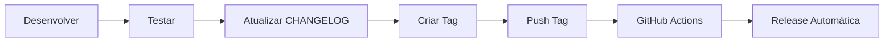

# Guia de Versionamento e Releases

Este documento explica como criar e gerenciar releases para este projeto dotfiles.

## 📋 Convenção de Versionamento

Usamos [Semantic Versioning](https://semver.org/lang/pt-BR/):

```
MAJOR.MINOR.PATCH (ex: 1.2.3)
```

- **MAJOR** (1.x.x): Mudanças incompatíveis ou reestruturação completa
- **MINOR** (x.1.x): Novas funcionalidades compatíveis
- **PATCH** (x.x.1): Correções de bugs e melhorias pequenas

### Exemplos

- `v1.0.0` - Release inicial estável
- `v1.1.0` - Adiciona novo script de backup
- `v1.1.1` - Corrige bug no script de wallpaper
- `v2.0.0` - Migração de X11 para Wayland (breaking change)

## 🚀 Como Criar uma Release

### Método 1: Via Git Tag (Recomendado)

```bash
# 1. Atualize o CHANGELOG.md com as mudanças
vim CHANGELOG.md

# 2. Commit as mudanças
git add CHANGELOG.md
git commit -m "docs: update changelog for v1.0.0"

# 3. Crie uma tag
git tag -a v1.0.0 -m "Release v1.0.0"

# 4. Envie a tag para o GitHub
git push origin v1.0.0
```

O workflow `release.yml` será acionado automaticamente e criará a release!

### Método 2: Via GitHub Actions (Manual)

1. Vá para: `https://github.com/ticogafa/dotfiles/actions/workflows/release.yml`
2. Clique em **"Run workflow"**
3. Preencha:
   - **version**: `v1.0.0`
   - **prerelease**: marque se for beta/alpha
4. Clique em **"Run workflow"**

### Método 3: Via Interface do GitHub

1. Vá para: `https://github.com/ticogafa/dotfiles/releases/new`
2. Preencha:
   - **Tag**: `v1.0.0`
   - **Title**: `Release v1.0.0`
   - **Description**: Copie do CHANGELOG.md
3. Anexe arquivos (opcional)
4. Clique em **"Publish release"**

## 📝 Checklist antes de Release

- [ ] Atualizar `CHANGELOG.md` com todas as mudanças
- [ ] Testar todos os workflows (Actions devem estar ✅)
- [ ] Verificar que não há TODOs críticos
- [ ] Atualizar `README.md` se necessário
- [ ] Verificar que `pkglist.txt` e `aur_pkglist.txt` estão atualizados
- [ ] Fazer commit de todas as mudanças pendentes
- [ ] Testar instalação em ambiente limpo (opcional mas recomendado)

## 📦 O que a Release Inclui

O workflow automático gera:

### Arquivos Compactados
- `dotfiles-vX.X.X.tar.gz` - Tarball das configurações
- `dotfiles-vX.X.X.zip` - ZIP das configurações
- Checksums SHA256 de ambos

### Arquivos Individuais
- `pkglist.txt` - Lista de pacotes oficiais
- `aur_pkglist.txt` - Lista de pacotes AUR

### Release Notes
Geradas automaticamente com:
- Changelog da versão
- Estatísticas (scripts, pacotes, linhas de código)
- Instruções de instalação
- Links úteis

## 🏷️ Tipos de Release

### Stable Release (v1.0.0)
- Completamente testada
- Documentação completa
- Sem `prerelease: true`

### Pre-Release (v1.0.0-beta, v1.0.0-rc1)
- Para testes
- Pode ter bugs conhecidos
- Use `prerelease: true` no workflow

### Hotfix (v1.0.1)
- Correção urgente
- Apenas mudanças críticas
- Deploy rápido

## 📊 Exemplo de Entrada no CHANGELOG.md

```markdown
## [1.1.0] - 2025-12-15

### Adicionado
- Script de backup automático para configurações
- Suporte para múltiplos monitores no Hyprland
- Nova keybinding para screenshot de janela ativa

### Modificado
- Waybar agora mostra temperatura da GPU
- Melhorado desempenho do script de wallpaper

### Corrigido
- Bug ao trocar wallpaper com pywal
- Erro de permissão no power.sh

### Removido
- Configuração obsoleta do i3 (migrado para Hyprland)
```

## 🔄 Workflow de Release



## 🎯 Boas Práticas

1. **Sempre atualize o CHANGELOG** antes de criar release
2. **Use tags anotadas**: `git tag -a` (não `git tag`)
3. **Teste antes de release**: Execute os workflows manualmente
4. **Versão semântica**: Siga rigorosamente o padrão
5. **Comunicação clara**: Release notes devem ser compreensíveis
6. **Backup**: Sempre mantenha backup antes de releases maiores

## 🐛 Solução de Problemas

### Release não foi criada após push da tag
- Verifique se a tag segue o formato `v*.*.*`
- Confirme que o workflow `release.yml` está habilitado
- Verifique logs em: `https://github.com/ticogafa/dotfiles/actions`

### Erro de permissão ao criar release
- Verifique se `GITHUB_TOKEN` tem permissão `contents: write`
- Em Settings → Actions → General → Workflow permissions

### Arquivos não anexados na release
- Verifique se os caminhos em `files:` estão corretos
- Confirme que os arquivos foram criados no step anterior

## 📚 Recursos

- [Semantic Versioning](https://semver.org/lang/pt-BR/)
- [Keep a Changelog](https://keepachangelog.com/pt-BR/1.0.0/)
- [GitHub Releases Documentation](https://docs.github.com/en/repositories/releasing-projects-on-github)
- [action-gh-release](https://github.com/softprops/action-gh-release)

## 🎉 Sua Primeira Release

Pronto para criar a primeira release?

```bash
# 1. Certifique-se de que tudo está commitado
git status

# 2. Crie a tag v1.0.0
git tag -a v1.0.0 -m "🎉 First stable release"

# 3. Envie para o GitHub
git push origin v1.0.0

# 4. Aguarde ~3 minutos e veja em:
# https://github.com/ticogafa/dotfiles/releases
```

🎊 **Parabéns!** Sua primeira release está pronta!
